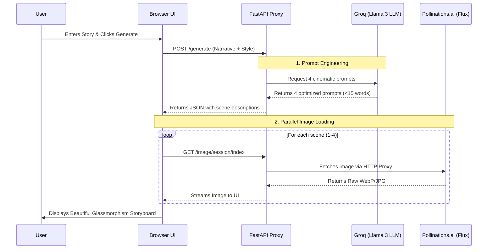

# 🎬 The Pitch Visualizer

The Pitch Visualizer is an AI-powered tool designed to transform text narratives—like customer success stories, game concepts, or movie pitches—into stunning, professional visual storyboards in seconds. 

It combines high-speed LLM reasoning with free open-source diffusion models to generate high-quality images without relying on expensive, proprietary API keys.

---

## 🚀 Architecture & Flow



### 🧠 The Flow in Plain English:
1. **You Type a Story:** You paste a short story into the website and click "Generate".
2. **The AI Reads It:** The website sends your story to our Python backend, which forwards it to an advanced text-AI (Groq's Llama 3). 
3. **Writing the Script:** The text-AI acts like a movie director. It chops your story into 4 scenes and writes a highly descriptive, short visual prompt for each scene (like *"Cinematic shot of a hacker at a computer"*).
4. **Drawing the Pictures:** Now that we have 4 visual prompts, our backend sends them to an Image-AI (Pollinations' Flux model). 
5. **The Final Output:** The Image-AI draws the 4 images and sends them back to the website to be displayed inside our stunning glass-themed interface!

## ✨ "Wow-Factor" Features

*   **▶️ Presentation Mode:** A built-in immersive pitch deck mode. When clicked, the screen darkens, the images slowly zoom (Ken Burns effect), and the browser natively narrates the story out loud using the Web Speech API.
*   **📥 PDF Export:** Instantly packages the generated storyboard and textual prompts into a clean, professional A4 PDF Pitch Deck using `html2pdf.js`.
*   **🔁 Advanced Error Handling:** The FastAPI backend proxy handles image rendering transparently. Rate limited? It uses exponential backoff to automatically retry image generation to ensure success.

## 💻 Running Locally

1. **Clone the repository:**
   ```bash
   git clone https://github.com/Yashraj0906/Pitch_Visualizer.git
   cd Pitch_Visualizer
   ```

2. **Set up your environment variables:**
   Create a `.env` file in the root directory and add your free Groq API key:
   ```env
   GROQ_API_KEY=your_groq_api_key_here
   ```

3. **Install dependencies and run the server:**
   Using `uv` (the blazing fast Python package manager):
   ```bash
   uv run uvicorn main:app --reload
   ```

4. **Open the app:**
   Navigate to `http://127.0.0.1:8000` in your web browser.
